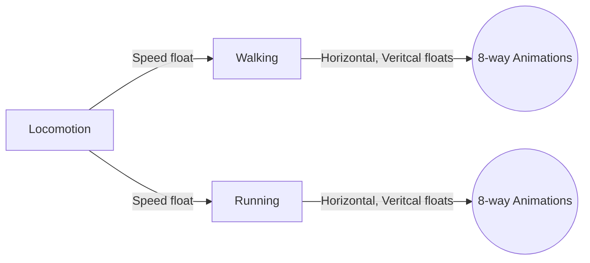

# Unity Third Person Combat and Locomotion System
 
## Usage
To use this controller, you would need a character with an animator component, Character Controller, lock on system, Character Context, and the player input handler.

You will also need to create a game object for your camera and have a child object for the camera pivot that the camera will be a child of. The Parent game object will have the camera controller script. From there you should set your references.

With the lock-on, you can use a GUI image or any game object as the target retical that will appear above targets when locking on.

## Animator
The animator will contain a blend tree that will manage the character locomotion. The Parameters for the animator are:
1. Vertical
2. Horizontal
3. Speed

The Locomotion blend tree will have a blend type of 1D with two blend trees attached (2d-free form) which are responsible for walking and running. Feel free to add an intermediary blend tree for sprinting. (You would just need to update the thresholds to account for it). The current thresholds are 0.5 for walking and 1 for running.

The blend trees will be set up as:

I am currently working on adding other features such as climbing, attacking, combos, dodging, falling, jumping, and taking damage so any other animations will be added in the future with the usage here.

## Known Issues
1. New release of my current project broke on my website. :(

## Upcoming features and changes
1. Updating the movement system to be camera relative locomotion
2. Adding crouching
3. Adding Rolling/Dodging
4. Adding basic enemy AI

## Combat
Combat has not been started yet. I am still working on the basic mechanics so they can be refined and work as smoothly as possible.

## Demo
To play the demo please click [here](https://amekhail.github.io/Game%20Builds/tech_demo/index.html)

## Notes
I will try to keep this readme updated as much as possible as I add more features. 
