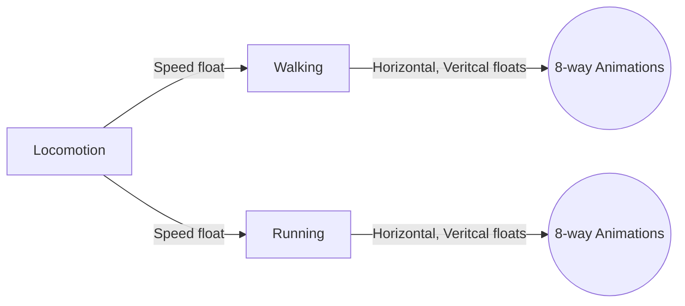

# Unity Third Person Combat and Locomotion System
 
## Usage
To use this, controller, you would need a character with an animator component, Character Controller, Character Context, and the player input handler.

## Animator
The animator will contain a blend tree that will manage the character locomotion. The Parameters for the animator are:
1. Vertical
2. Horizontal
3. Speed

The Locomotion blend tree will have a blend type of 1D with two blend trees attached (2d-free form) which are responsible for walking and running. Feel free to add an intermediary blend tree for sprinting. (You would just need to update the thresholds to account for it). The current thresholds are 0.5 for walking and 1 for running.

The blend trees will be set up as:

I am currently working on adding other features such as climbing, attacking, combos, dodging, falling, jumping, and taking damage so any other animations will be added in the future with the usage here.